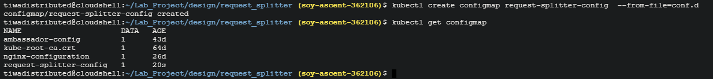

https://drive.google.com/drive/u/1/folders/14iviPpN6mwuDgbr3dgNOw4fnIj21cBoE
```sh
# Signing into faas-cli
    curl -SLsf https://cli.openfaas.com | sudo sh && \
    export OPENFAAS_URL="34.95.40.92:8080" && \
    PASSWORD=$(kubectl get secret -n openfaas basic-auth -o jsonpath="{.data.basic-auth-password}" | base64 --decode; echo) && \
    echo $PASSWORD
    echo -n $PASSWORD | faas-cli login --username admin --password-stdin
```

```sh
    # pull the python3-flask openfaas template
    faas-cli template store pull python3-flask
```

```sh
    # Creating a new openfaas function of language type python3-flask-debian
    faas-cli new --lang python3-flask-debian --prefix us.gcr.io/soy-ascent-362106 get-loc
```

```sh
    # Build, push, & deploy location-extractor to openFaas
    faas-cli build -f get-loc.yml -b TEST_ENABLED=false && docker push us.gcr.io/soy-ascent-362106/get-loc && faas-cli deploy -f get-loc.yml

    # or
    faas-cli up -f get-loc.yml -b TEST_ENABLED=false
```

## 2: Apply autoscaling to the backend deployment.

    Updated the news-backend.yaml file with HPA and reference the location-exrtactor function. Below is the updated news-backend.yaml file.

```yaml
apiVersion: autoscaling/v2
kind: HorizontalPodAutoscaler
metadata:
  name: news-backend
spec:
  scaleTargetRef:
    apiVersion: apps/v1
    kind: Deployment
    name: news-backend
  minReplicas: 1
  maxReplicas: 5
  metrics:
  - type: Resource
    resource:
      name: cpu
      target:
        type: Utilization
        averageUtilization: 10
```


## 4: Creating a Request Splitter

- Create a config map and update the deployments to 70% to 30% split.
    ```nginx
        upstream backend {
        server news-frontend-clone:80 weight=7;
        server news-frontend:80 weight=3;
        }
        server {
            location / {
            proxy_pass http://backend;
            }
        }
    ```
- Deploy a request-splitter service and deployment.
    ```yaml
    # request-splitter-deployment.yaml
    apiVersion: apps/v1
    kind: Deployment
    metadata:
    name: request-splitter-deployment
    spec:
    selector:
        matchLabels:
        app: request-splitter
    replicas: 2 # tells deployment to run 2 pods matching the template
    template: # create pods using pod definition in this template
        metadata:
        labels:
            app: request-splitter
        spec:
        containers:
        - image: nginx
            name: request-splitter
            ports:
            - containerPort: 80
            volumeMounts:
            - name: config-volume
            mountPath: etc/nginx/conf.d
        volumes:
        - name: config-volume
            configMap:
            name: request-splitter-config
    ---
    apiVersion: v1
    kind: Service
    metadata:
    name: request-splitter
    labels:
        app: request-splitter
    spec:
    type: LoadBalancer
    ports:
    - port: 80
        targetPort: 80
    selector:
        app: request-splitter

    ```
- Create a configmap
    ```sh
        kubectl create configmap request-splitter-config --from-file=conf.d
    ```
    
- Deploy the news-frontend & news-frontend-clone
    ```yaml
        # news-frontend
        apiVersion: v1
        kind: Service
        metadata:
        labels:
            app: news-frontend
        name: news-frontend
        #namespace: admin-che
        spec:
        type: LoadBalancer
        ports:
            - port: 80
            targetPort: 80
            #nodePort: 31111
        selector:
            app: news-frontend
        ---
        apiVersion: apps/v1
        kind: Deployment
        metadata:
        name: news-frontend
        #namespace: admin-che
        labels:
            app: news-frontend
        spec:
        replicas: 1
        selector:
            matchLabels:
            app: news-frontend
        template:
            metadata:
            labels:
                app: news-frontend
            spec:
            containers:
                - env:
                    - name: NODE_PORT
                    value: "8080"
                    - name: NODE_IP
                    value: "34.152.59.64"                       #todo: replace <backend IP address> with the IP address of the backend component
                image: us.gcr.io/soy-ascent-362106/news-frontend             #todo: replace <project_ID> with your actual project_ID
                name: news-frontend
                imagePullPolicy: Always
                ports:
                    - containerPort: 80
    ```
    ```yaml

    ```

    [Refer here for full report](https://drive.google.com/drive/u/1/folders/14iviPpN6mwuDgbr3dgNOw4fnIj21cBoE)